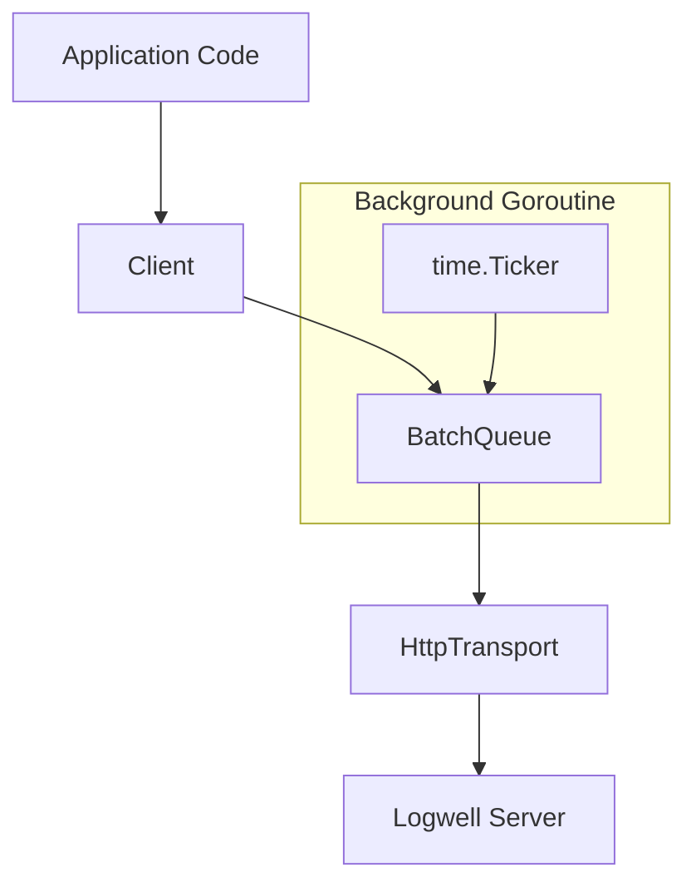

# Design: Go SDK for Logwell

## Overview

Single-package SDK (`github.com/Divkix/Logwell/sdks/go/logwell`) with stdlib-only dependencies. Uses goroutine + channel for background batch processing. Functional options pattern for configuration.

## Architecture

```
logwell/
  client.go       # Main Client struct and public API
  config.go       # Config validation and defaults
  errors.go       # Error types and codes
  queue.go        # Batch queue with timer
  transport.go    # HTTP client with retry
  source.go       # runtime.Caller wrapper
  types.go        # LogEntry, LogLevel, IngestResponse
  doc.go          # Package documentation
```



## Components

### Client

**Purpose**: Primary entry point for logging

**Responsibilities**:
- Hold config and references to queue/transport
- Provide level-specific log methods
- Manage child logger creation
- Handle stopped state

```go
type Client struct {
    config         Config
    queue          *batchQueue
    transport      *httpTransport
    parentMetadata map[string]any
    stopped        atomic.Bool
}

// Public methods
func New(endpoint, apiKey string, opts ...Option) (*Client, error)
func (c *Client) Debug(msg string, metadata ...map[string]any)
func (c *Client) Info(msg string, metadata ...map[string]any)
func (c *Client) Warn(msg string, metadata ...map[string]any)
func (c *Client) Error(msg string, metadata ...map[string]any)
func (c *Client) Fatal(msg string, metadata ...map[string]any)
func (c *Client) Log(entry LogEntry)
func (c *Client) Child(opts ...ChildOption) *Client
func (c *Client) Flush(ctx context.Context) (*IngestResponse, error)
func (c *Client) Shutdown(ctx context.Context) error
func (c *Client) QueueSize() int
```

### Config

**Purpose**: Hold validated configuration values

**Responsibilities**:
- Store all configuration options
- Provide defaults via functional options
- Validate required fields and formats

```go
type Config struct {
    Endpoint              string
    APIKey                string
    Service               string
    BatchSize             int
    FlushInterval         time.Duration
    MaxQueueSize          int
    MaxRetries            int
    CaptureSourceLocation bool
    OnError               func(error)
    OnFlush               func(count int)
}

// Defaults
const (
    DefaultBatchSize     = 50
    DefaultFlushInterval = 5 * time.Second
    DefaultMaxQueueSize  = 1000
    DefaultMaxRetries    = 3
)

// Functional options
type Option func(*Config)
func WithService(s string) Option
func WithBatchSize(n int) Option
func WithFlushInterval(d time.Duration) Option
func WithMaxQueueSize(n int) Option
func WithMaxRetries(n int) Option
func WithSourceLocation(enabled bool) Option
func WithOnError(fn func(error)) Option
func WithOnFlush(fn func(int)) Option
```

### BatchQueue

**Purpose**: Buffer logs and manage automatic flushing

**Responsibilities**:
- Thread-safe log addition
- Size-based and time-based auto-flush
- Overflow protection with oldest-drop
- Re-queue on failure

```go
type batchQueue struct {
    entries    []LogEntry
    mu         sync.Mutex
    sendBatch  func([]LogEntry) (*IngestResponse, error)
    config     queueConfig
    timer      *time.Timer
    flushing   bool
    stopped    bool
    flushCh    chan struct{}
    doneCh     chan struct{}
}

func newBatchQueue(send sendBatchFunc, cfg queueConfig) *batchQueue
func (q *batchQueue) add(entry LogEntry)
func (q *batchQueue) flush(ctx context.Context) (*IngestResponse, error)
func (q *batchQueue) shutdown(ctx context.Context) error
func (q *batchQueue) size() int
```

### HttpTransport

**Purpose**: Send log batches to server with retry

**Responsibilities**:
- HTTP POST to `/v1/ingest`
- Bearer token authentication
- Exponential backoff with jitter
- Error classification

```go
type httpTransport struct {
    client     *http.Client
    ingestURL  string
    apiKey     string
    maxRetries int
}

func newHttpTransport(cfg transportConfig) *httpTransport
func (t *httpTransport) send(ctx context.Context, logs []LogEntry) (*IngestResponse, error)
```

### Error Types

**Purpose**: Structured errors with codes

```go
type ErrorCode string

const (
    ErrNetworkError    ErrorCode = "NETWORK_ERROR"
    ErrUnauthorized    ErrorCode = "UNAUTHORIZED"
    ErrValidationError ErrorCode = "VALIDATION_ERROR"
    ErrRateLimited     ErrorCode = "RATE_LIMITED"
    ErrServerError     ErrorCode = "SERVER_ERROR"
    ErrQueueOverflow   ErrorCode = "QUEUE_OVERFLOW"
    ErrInvalidConfig   ErrorCode = "INVALID_CONFIG"
)

type Error struct {
    Code       ErrorCode
    Message    string
    StatusCode int
    Retryable  bool
}

func (e *Error) Error() string
func (e *Error) Is(target error) bool
```

### Types

**Purpose**: Data structures for logs and responses

```go
type LogLevel string

const (
    LevelDebug LogLevel = "debug"
    LevelInfo  LogLevel = "info"
    LevelWarn  LogLevel = "warn"
    LevelError LogLevel = "error"
    LevelFatal LogLevel = "fatal"
)

type LogEntry struct {
    Level      LogLevel       `json:"level"`
    Message    string         `json:"message"`
    Timestamp  string         `json:"timestamp,omitempty"`
    Service    string         `json:"service,omitempty"`
    Metadata   map[string]any `json:"metadata,omitempty"`
    SourceFile string         `json:"sourceFile,omitempty"`
    LineNumber int            `json:"lineNumber,omitempty"`
}

type IngestResponse struct {
    Accepted int      `json:"accepted"`
    Rejected int      `json:"rejected,omitempty"`
    Errors   []string `json:"errors,omitempty"`
}
```

### Source Location

**Purpose**: Capture caller file/line info

```go
type SourceLocation struct {
    File string
    Line int
}

func captureSource(skip int) *SourceLocation
```

## Data Flow

1. App calls `client.Info("msg", metadata)`
2. Client builds `LogEntry` with timestamp, level, metadata
3. If source capture enabled, `runtime.Caller()` called
4. Entry passed to `queue.add()`
5. Queue appends to buffer, starts timer if first entry
6. When batch size reached OR timer fires:
   - Queue calls `transport.send(batch)`
   - On success: `onFlush` callback, clear batch
   - On failure: re-queue batch, `onError` callback
7. On shutdown: flush remaining, stop timer

## Technical Decisions

| Decision | Options | Choice | Rationale |
|----------|---------|--------|-----------|
| Config pattern | Struct / Functional opts | Functional opts | Idiomatic Go, optional params |
| Queue sync | Mutex / Channel | Mutex | Simpler, sufficient for this use |
| Timer | time.Timer / time.Ticker | time.Timer | Single-shot reset pattern |
| HTTP client | stdlib / fasthttp | stdlib | No external deps, sufficient perf |
| JSON encoding | encoding/json | encoding/json | Stdlib, no perf bottleneck |

## File Structure

| File | Action | Purpose |
|------|--------|---------|
| sdks/go/logwell/client.go | Create | Main client API |
| sdks/go/logwell/config.go | Create | Options and validation |
| sdks/go/logwell/errors.go | Create | Error types |
| sdks/go/logwell/queue.go | Create | Batch queue |
| sdks/go/logwell/transport.go | Create | HTTP transport |
| sdks/go/logwell/source.go | Create | Source location |
| sdks/go/logwell/types.go | Create | Data types |
| sdks/go/logwell/doc.go | Create | Package docs |
| sdks/go/go.mod | Create | Go module |
| sdks/go/README.md | Create | Usage docs |

## Error Handling

| Error | Handling | User Impact |
|-------|----------|-------------|
| Invalid API key format | Return error from `New()` | Cannot create client |
| Invalid endpoint URL | Return error from `New()` | Cannot create client |
| Network failure | Retry with backoff, then `onError` | Logs re-queued |
| 401 Unauthorized | No retry, `onError` | Logs lost, error surfaced |
| 429 Rate Limited | Retry with backoff | Temporary delay |
| 5xx Server Error | Retry with backoff | Temporary delay |
| Queue overflow | Drop oldest, `onError` | Oldest log lost |
| Context cancelled | Return ctx.Err() | Operation aborted |

## API Examples

### Basic Usage

```go
client, err := logwell.New(
    "https://logs.example.com",
    "lw_xxxxxxxxxxxxxxxxxxxxxxxxxxxxxxxx",
)
if err != nil {
    log.Fatal(err)
}
defer client.Shutdown(context.Background())

client.Info("User logged in", map[string]any{"userId": "123"})
```

### With Options

```go
client, err := logwell.New(
    "https://logs.example.com",
    "lw_xxxxxxxxxxxxxxxxxxxxxxxxxxxxxxxx",
    logwell.WithService("my-app"),
    logwell.WithBatchSize(100),
    logwell.WithFlushInterval(10*time.Second),
    logwell.WithOnError(func(err error) {
        fmt.Println("Logwell error:", err)
    }),
)
```

### Child Logger

```go
requestLogger := client.Child(
    logwell.WithChildMetadata(map[string]any{"requestId": reqID}),
)
requestLogger.Info("Processing request")
```

## Existing Patterns to Follow

- Package naming: lowercase, single word (`logwell`)
- Exported types: CamelCase
- Options: `With*` prefix
- Context: first parameter for blocking funcs
- Errors: return as last value
